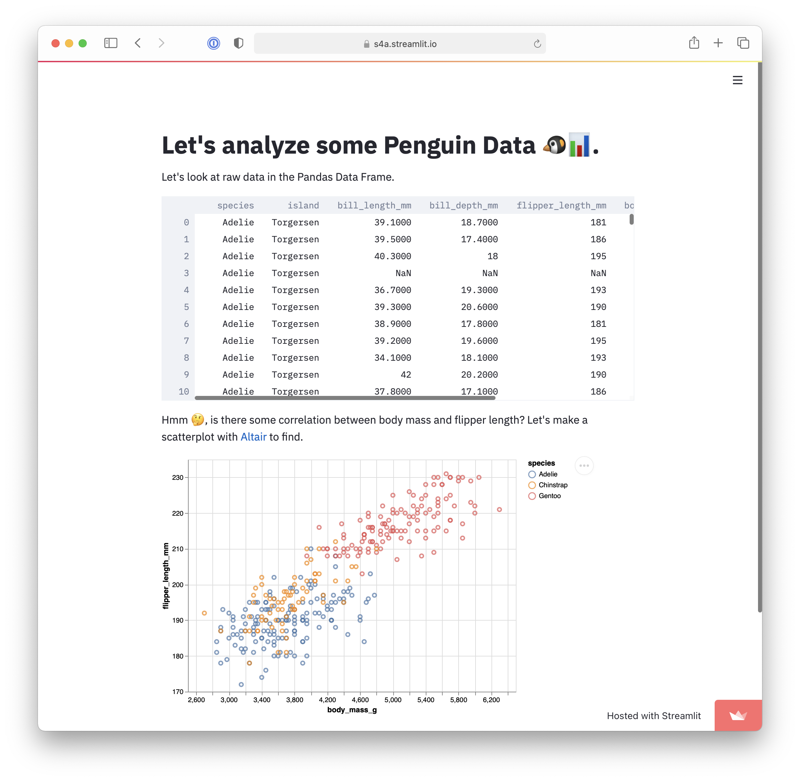

# Project name

TODO: Update screenshot

TODO: Short abstract describing the main goals and how you achieved them.

(Tentative) Our project considered the key indicators of social mobility in American society through the lens of
economic, health, and education indicators.

## Project Goals

TODO: **A clear description of the goals of your project.** Describe the question that you are enabling a user to answer. The question should be compelling and the solution should be focused on helping users achieve their goals. 

## Design

TODO: **A rationale for your design decisions.** How did you choose your particular visual encodings and interaction techniques? What alternatives did you consider and how did you arrive at your ultimate choices?

After selecting a dataset, we began by sketching a few initial designs independently.

[TODO: link initial sketches?](link_placeholder)

[TODO: link initial sketches?](link_placeholder)

Our data has a fundamentally geographic component which we thought should be clearly shared through the use of a map for
country-wide comparisons. This medium is difficult to show smaller changes and make comparisons between different
attributes of the same state and for this, we allowed a user to interact with the map to identify the state they wanted
more information about.

## Development

TODO: **An overview of your development process.** Describe how the work was split among the team members. Include a commentary on the development process, including answers to the following questions: Roughly how much time did you spend developing your application (in people-hours)? What aspects took the most time?

We began with sketching and came up with a handful of initial designs that we shared and used as a guide for our initial
work.  This initial exploration based on our intuitions about the data lead us to explore the data and interactions
between different attributes.

## Success Story

TODO:  **A success story of your project.** Describe an insight or discovery you gain with your application that relates to the goals of your project.
