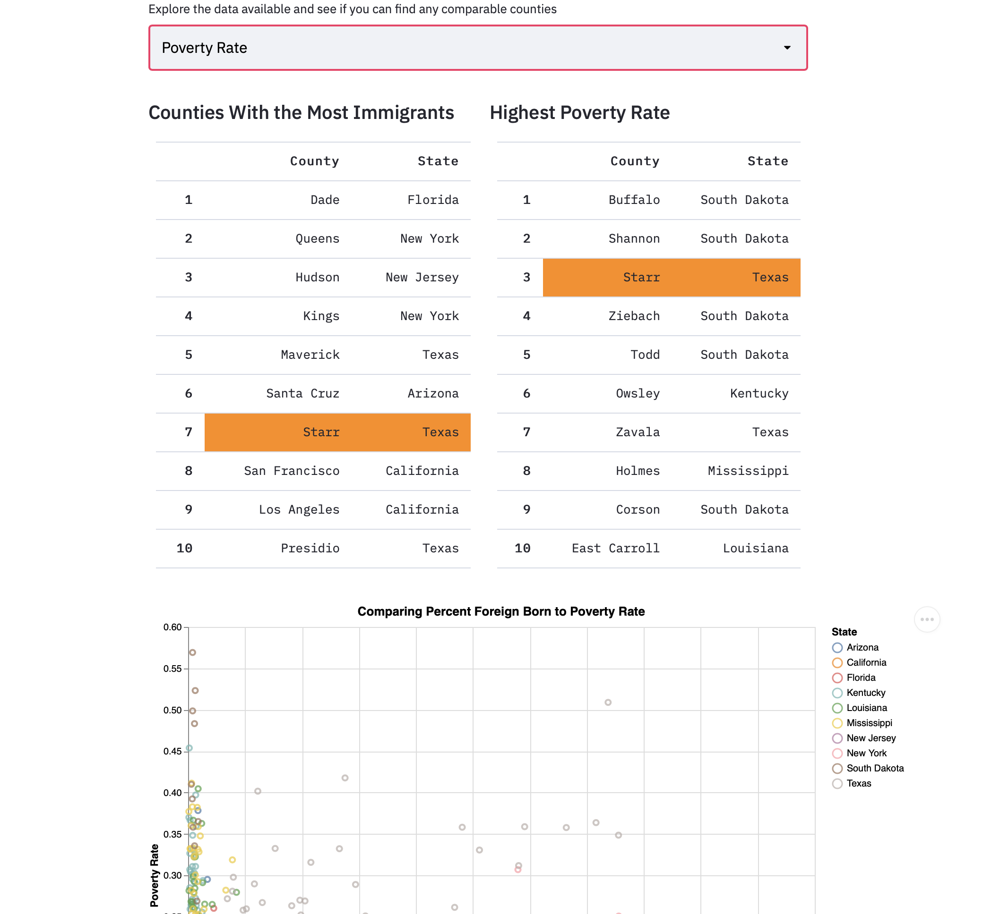
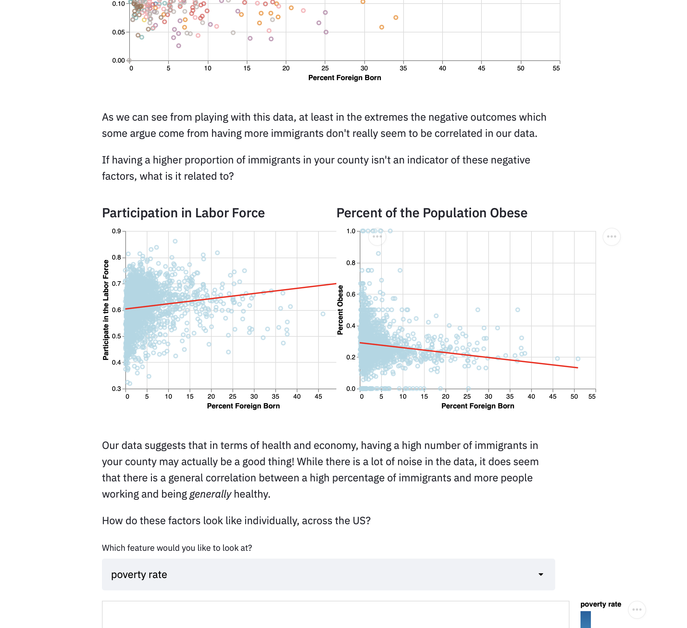
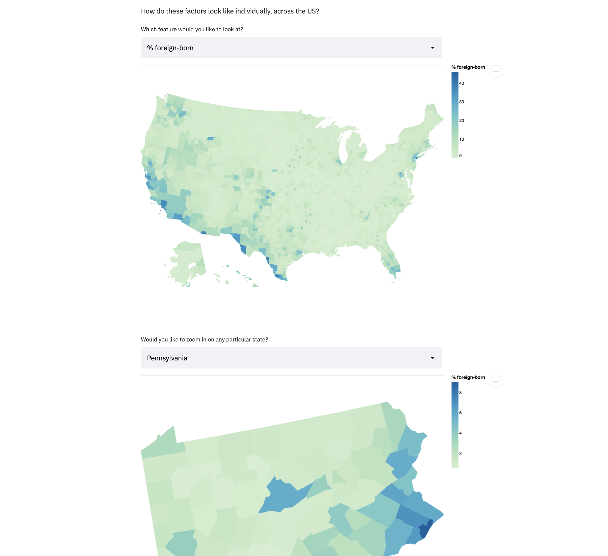
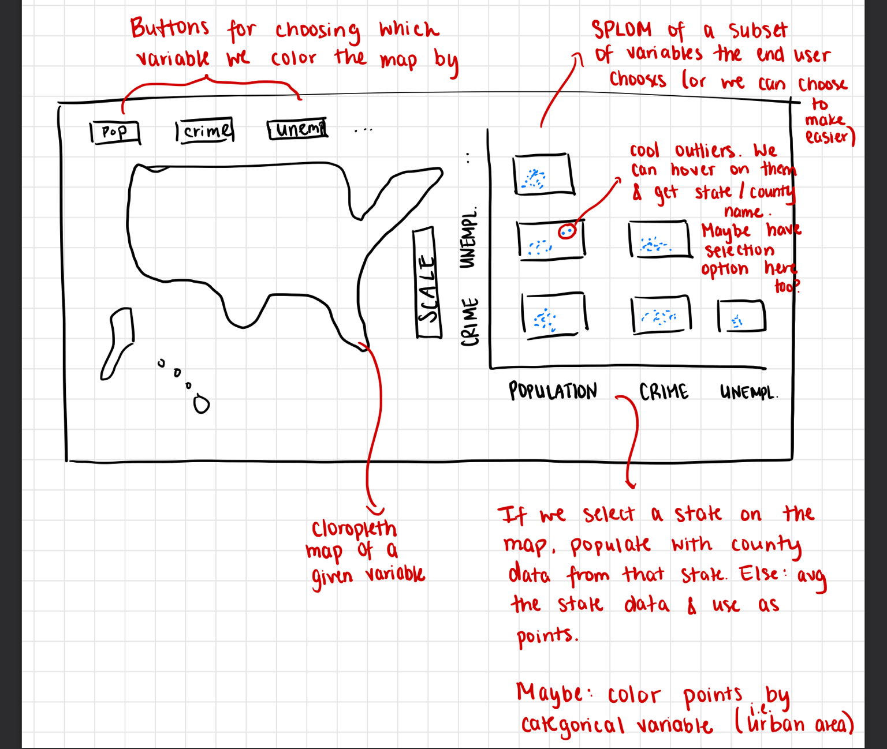
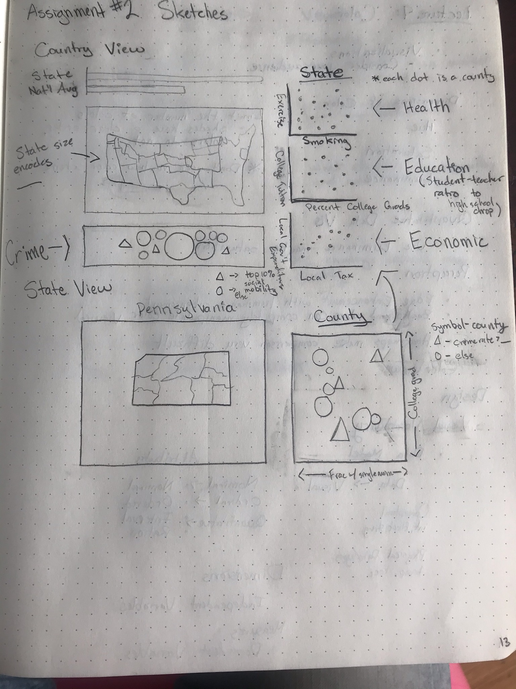
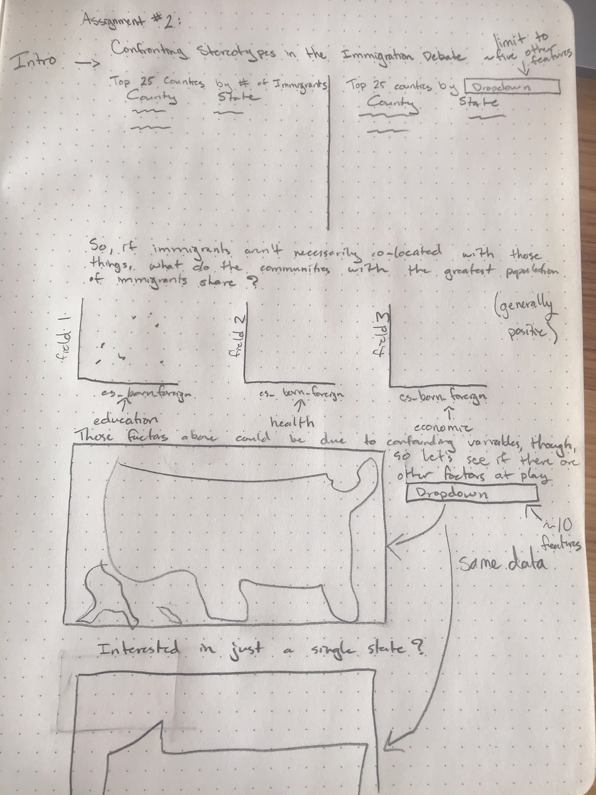

# Confronting Stereotypes in the Immigration Debate

One does not have to look far or hard to find political commentary peddling the dangers of allowing widespread
immigration into the United States. When many voices speak with authority, it can be difficult to know what to listen
to and how to distinguish fact from fiction. While data may not be perfect, and we certainly do not claim to be, we
think that by exploring some statistics behind the claims, we can offer a different perspective. For our
analysis we considered 
[this summary](https://www.cato.org/blog/14-most-common-arguments-against-immigration-why-theyre-wrong) of common
arguments against liberal immigration policies in America. It is written by
[Alex Nowrasteh](https://www.cato.org/people/alex-nowrasteh), the Director of Immigration Studies at the Center For
Global Liberty And Prosperity within the [CATO Institute](https://www.cato.org). The CATO institute is a Washington DC
based think tank that has been in operation since the late 1970s.  While Mr. Nowrasteh offers some economic and
theoretical counter arguments to common immigration concerns, we visualized data made available by Raj Chetty's
(Harvard University) group, [Opportunity Insights](https://opportunityinsights.org), that studies social mobility
within America to augment Mr. Nowrasteh's arguments.

## Project Goals

Our goal in this project was to challenge common stereotypes or misconceptions people may hold about
the role immigrants play in American society. While this is a challenging topic to explore in great 
detail, we looked at some research conducted by a DC think tank and attempted to augment their
qualitative analysis with some data analysis.

## Design

After selecting a dataset, we began by sketching a few initial designs independently.

**Catalina's Sketch:**

**André's Sketch:**

Our data has a fundamentally geographic component which we thought should be clearly shared through the use of a map for
country-wide comparisons. This medium is difficult to show smaller changes, though, and making comparisons between
different attributes of the same state. In light of this challenge, we explored ways for a user to evaluate different
characteristics about our and generate some different graphs.  As you may note, our final design is somewhat similar
to these initial sketches, but we actually came up with the below final sketch from which we developed our final
visualizations.

As you can see, by working with our data for a number of days we found that some relationships existed we weren't
expecting and others did not materialize that we expected to see.

## Development

We began with sketching and came up with a handful of initial designs that we shared and used as a guide for our initial
work.  This initial exploration based on our intuitions about the data lead us to explore the data and interactions
between different attributes. After we both created many plots and iteratively improved them, we came up with a final design
and were (mostly) able to use our initial analysis in a streamlined way.

We spent close to 25 hours of "people" time in developing our visualization.  The majority of this time was dedicated
to understanding our dataset and exploring relationships within it.  Since it had so many features it was challenging to
see immediate relationships, so we turned to the DataVoyager tool to automatically generate more plots to identify some
initial relationships.

We worked together by coming up with designs independently (in order to try and maximize unique ideas) and then came 
together and discussed which designs we found most compelling and then we split development efforts along similar lines
of interest.

## Success Story

It was interesting to me that many of the "negative" factors seemed uncorrelated with % foreign born, particularly 
poverty rate, as this is one of the strongest stereotypes towards immigrants in the US. The vastness of negative
rhetoric directed towards immigrants is hard to reconcile when we evaluate this dataset and see so many examples of
no correlation or of a correlation with a more "positive" tone.
